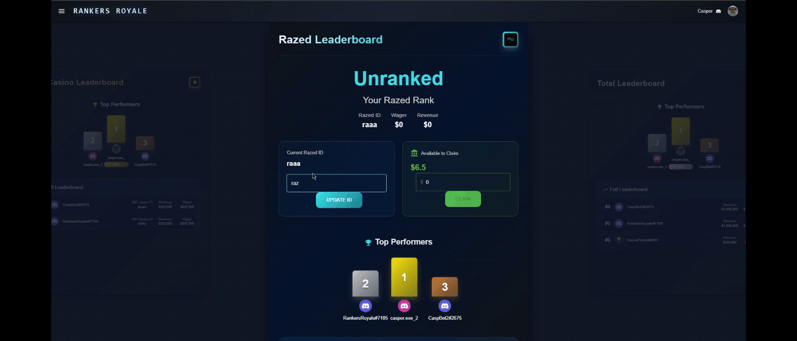
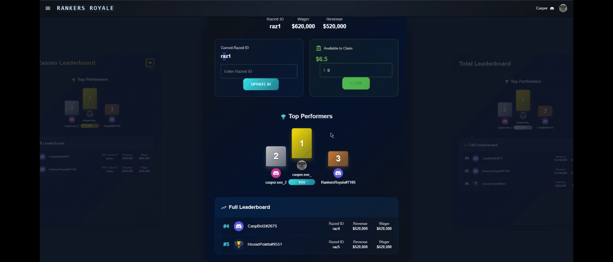
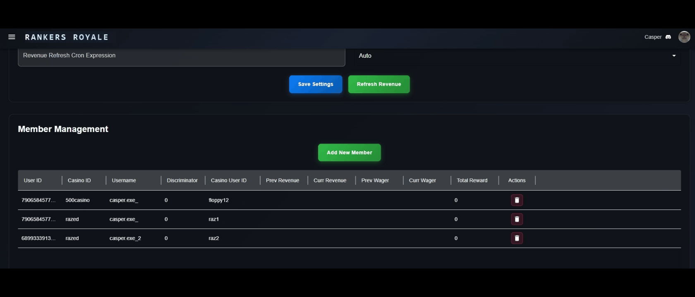
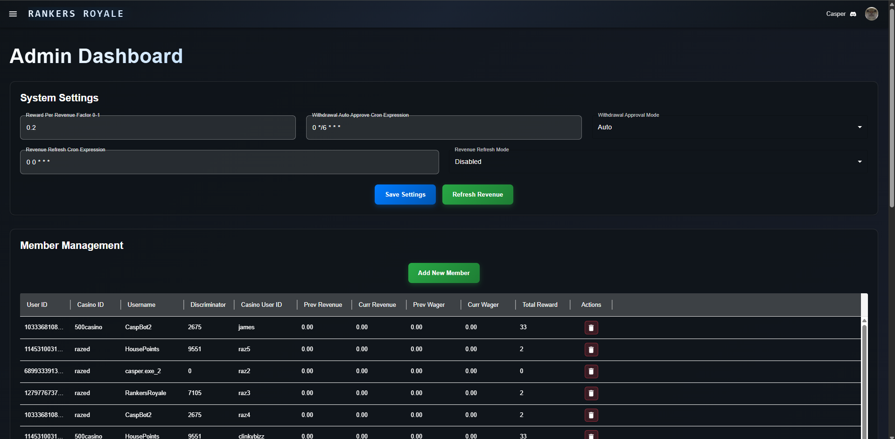

# Rankers Royale

## Overview
Rankers Royale is a complete web application for ranking users by points earned per season from different wagering sites. Users can redeem points through a shop or direct payouts to their wagering site account wallets.

## Features
- Leaderboard ranking system based on points earned per season
- Points redemption via shop or direct payouts
- Discord OAuth2 login
- Admin page to manage shop items, user wagering site usernames, and points
- Auto redeem/manual settings
- Leaderboard reset and new season management
- Chrome extension build mode

## Application Screenshots

### User Authentication & Management
 - Discord OAuth2 login flow and user authentication

### User ID Validation
 - Successfully linking a valid leaderboard user
 - Linking a non-leaderboard user

### Member Management
 - Admin panel for managing user memberships and settings
 - Complete admin dashboard with system settings and member management

## Authentication System

### Discord OAuth2 Integration
The application uses Discord OAuth2 for secure user authentication and server membership verification. Here's how it works:

#### Authentication Flow
1. **User Login**: Users click a login button that redirects to Discord's OAuth2 authorization page
2. **Discord Authorization**: Users authorize the application to access their Discord account information
3. **Code Exchange**: Discord redirects back with an authorization code, which is exchanged for an access token
4. **User Verification**: The system verifies the user is a member of the configured Discord server
5. **JWT Token**: A JWT containing the Discord user ID is created and stored in secure HTTP-only cookies
6. **Session Management**: Users remain authenticated using this JWT token for subsequent requests

#### Security Features
- **Server Membership Required**: Only users who are members of the configured Discord server can access the application
- **Role-Based Access Control**: Admin privileges are determined by Discord server roles
- **Secure Token Storage**: JWT tokens are stored in HTTP-only cookies with appropriate expiration
- **Real-time Verification**: Discord bot continuously syncs server membership for up-to-date access control

#### Technical Implementation
- **Discord Bot**: Runs alongside the application to maintain a cache of verified server members
- **JWT Authentication**: Lightweight tokens containing only Discord user IDs for fast verification
- **Automatic Sync**: Bot automatically updates member cache when users join/leave the server or change roles
- **No Database Queries**: Authentication is handled through fast cache lookups rather than database queries

This authentication system provides a seamless user experience while ensuring only authorized Discord community members can access the application.

## Getting Started

### Prerequisites
- Node.js (v16 or higher recommended)
- npm (comes with Node.js)
- (Optional) Docker, if you want to use the provided Docker setup

### 1. Install Dependencies
```bash
npm install
```

### 2. Environment Variables
Copy the sample environment file and fill in the required values (such as Discord OAuth credentials, database URLs, etc.):
```bash
cp sample.env .env
```

### 3. Start the App (Builds and Serves)
This command will build both the main app and the extension, then start the Express server serving the compiled frontend from `dist/`.
```bash
npm start
```
The app will be available at http://localhost:3000 (or the port specified in your environment variables).

### 4. Building Only the Main App or Extension
- To build only the main app:
  ```bash
  npm run buildapp
  ```
- To build only the Chrome extension:
  ```bash
  npm run buildext
  ```
- To build both (main app and extension):
  ```bash
  npm run build
  ```

### 5. Development Mode
- To run the Vite dev server for the main app:
  ```bash
  npm run dev
  ```
- To run the Vite dev server for the extension:
  ```bash
  npm run devext
  ```

### 6. Docker (Optional)
You can also run the app using Docker:
```bash
docker-compose up --build
```

---

**Note:**
- Make sure to configure your `.env` file before running the app.
- The extension build output will be in the appropriate directory (e.g., `dist/extension/`). You can load this as an unpacked extension in Chrome.
- There is no `build:extension` script; use `buildext` for the extension and `buildapp` for the main app.
- `npm start` is sufficient for production as it builds and starts the server.


